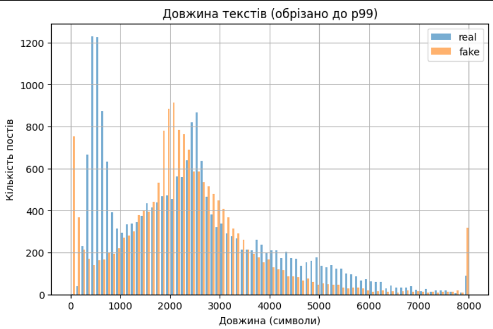
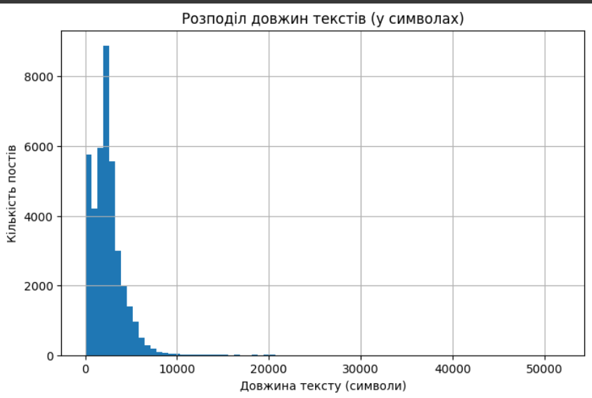

# Fake News Classification

## ✅ 1. Назва проєкту
**Fake News Classification** - класифікація новин (fake vs real) з порівнянням класичних підходів і трансформера (**BERT**).

## ✅ 2. Опис проєкту
- **Що це?** Повний DS-цикл: EDA -> очищення -> формування сплітів -> моделі -> підсумки.
- **Проблема:** автоматичне виявлення фейкових новин за текстом.
- **Для кого:** розробники/аналітики (відтворення пайплайна), рекрутери/замовники (огляд якості та рішень).
- **Очікуваний результат:** підбір кращої моделі для виявлення фейкових новин на основі порівняльних метрик.

## ✅ 3. Структура проєкту
```
fake-news-project/
├── README.md
├── .gitignore
├── notebooks/
│   ├── Fake_news_BERT.ipynb
│   ├── Fake_news_EDA.ipynb
│   ├── Fake_news_preprocessing_baseline_XGB.ipynb
│   └── Fake_news_results_summary.ipynb
├── results/
│   ├── final_project_model_results_summary.csv
│   └── figures/
│       ├── text_length_by_label_hist.png
│       ├── text_length_overall_hist.png
│       ├── wordcloud_overall.png
│       └── wordcloud_real_vs_fake.png
```

> **Leakage control:** очищення (видалення дублікатів за `text_all`) та вилучення `date` виконуються **безпосередньо в модельних ноутбуках перед формуванням сплітів**; спліти формуються без перетинів і з фіксованим `seed`.

## ✅ 4. Як запустити

### Google Colab (рекомендовано)

1) Відкрийте потрібний ноутбук із папки `notebooks/` у Colab.  

2) **Підвантажте сирий датасет** `fake_news_full_data.csv` у поточну директорію середовища, зазвичай `/content/`
(файл НЕ зберігається в репозиторії, посилання на нього нижче у п.5):
   - Через панель **Files → Upload**, або:
     ```python
     from google.colab import files
     files.upload()  # оберіть fake_news_full_data.csv
     ```
   - **(Опція)** Якщо зберігаєте у Google Drive:
     ```python
     from google.colab import drive
     drive.mount('/content/drive')
     # замініть шлях нижче на свій
     import pandas as pd
     raw_df = pd.read_csv("/content/drive/MyDrive/path/to/fake_news_full_data.csv", index_col=0)
     ```

3) У модельних ноутбуках дані читаються саме так (як у вашому коді):
   ```python
   import random, numpy as np, pandas as pd, torch

   def fix_seed(seed: int = 42):
       random.seed(seed); np.random.seed(seed); torch.manual_seed(seed)

   fix_seed(42)

   raw_df = pd.read_csv("fake_news_full_data.csv", index_col=0)
   raw_df.head()


4) Запускайте ноутбуки **по порядку**:
   1. `notebooks/Fake_news_EDA.ipynb`
   2. `notebooks/Fake_news_preprocessing_baseline_XGB (1).ipynb` - `DATA` -> очищення -> спліти -> класичні моделі
   3. `notebooks/Fake_news_BERT.ipynb` - `DATA` -> очищення -> спліти -> fine-tuning Bert
   4. `notebooks/Fake_news_results_summary.ipynb` - зведення метрик і графіки  
      (він читає локальний `final_project_model_results_summary.csv`, якщо ви його підвантажили поруч із ноутбуком, інакше - `results/final_project_model_results_summary.csv` з репозиторію).
    ```python
    from pathlib import Path
    import pandas as pd

    LOCAL = Path("final_project_model_results_summary.csv")            # локально підвантажений файл
    REPO  = Path("results/final_project_model_results_summary.csv")    # версія з репозиторію

    path = LOCAL if LOCAL.exists() else REPO
    print(f"Читаю з: {path}")
    df = pd.read_csv(path)
    df.head()
    ```

    
> Примітка: у кожному модельному ноутбуку очищення (видалення дублікатів за `text_all`, вилучення `date`) виконується **перед** формуванням сплітів.

## ✅ 5. Дані

**Джерело:** посилання: https://drive.google.com/file/d/1rribbwYNjHQ7EDiq3cA5CzEnqXCqD8-e/view?usp=sharing
**Файл:** `fake_news_full_data.csv` (завантажується локально; у Git не зберігається)

**Основні характеристики**
- Розмір: **44 680** рядків × **5** колонок
- Колонки та типи:
  - `Unnamed: 0` - `int64` (індекс/службове поле; можна видаляти перед обробкою)
  - `title` - `object` (заголовок)
  - `text` - `object` (повний текст новини)
  - `date` - `object` (рядкова дата публікації)
  - `is_fake` - `int64` (мітка класу: `0` - real, `1` - fake)
- Пропуски: **відсутні** у всіх колонках
- Баланс класів (`is_fake`): **1 -> 23 469**, **0 -> 21 211**

**Препроцесинг (у ноутбуках, перед сплітами)**
1. Видалення **дублікатів** за текстом (`text`).
2. Вилучення `date`** (щоб уникнути витоків).
3. Формування `train/val/test` з фіксованим `seed`.
4. `Unnamed: 0` відкидається як зайвий індекс.

> Дані завантажуються локально (рекомендована папка `data/`), а очищення та спліти виконуються всередині модельних ноутбуків.


## ✅ 6. EDA (Exploratory Data Analysis)
- Перевірка балансів класів, розподілів довжин текстів, n-грам, лексична різноманітність, приклади шумів.
- Деталі та графіки: `notebooks/Fake_news_EDA.ipynb`.

- ### Візуалізації (EDA)

<sub>Порівняння найвживаніших слів у real vs fake.</sub>


<sub>Загальний вордклауд по всьому корпусу.</sub>


<sub>Розподіл довжин текстів окремо для класів real та fake (обрізано по p99).</sub>


<sub>Загальний розподіл довжин текстів у символах.</sub>

## ✅ 7. Моделювання
**Тестувались:**
- **TF_IDF + Logistic Regression**
- **BOW + Logistic Regression**
- **TF-IDF + SVD + XGBoost**
- **BERT** (fine-tuning)

**Метрики:** F1, Accuracy, Precision, Recall.  
**Вибір залежить від компромісу:** якість <-> ресурси.

**Підсумкові матеріали**
- Зведена таблиця метрик: `results/final_project_model_results_summary.csv`,  `notebooks/Fake_news_results_summary.ipynb`

## ✅ 8. Результати
**Основні висновки**
- **BERT** - найкращий F1 (~0.999).
- **BOW + Logistic Regression** - майже як BERT за F1 (~0.996) і значно дешевший у виконанні (підійде для обмежених ресурсів/низької латентності).
- **TF_IDF + LogReg** - хороший, простий для пояснення бейзлайн (~0.986).
- **TF-IDF + SVD + XGBoost** - нижчі метрики (~0.983) у поточних налаштуваннях; потенціал з тюнінгом SVD/гіперпараметрів.

**Як це використовувати**
- Для **продакшну з акцентом на якість** -> **BERT**.
- Для **швидких/масштабних сценаріїв** або коли важлива проста інфраструктура -> **BOW + LogReg**.

**Обмеження та ризики**
- Дані **сирі** у репозиторії; очищення (видалення дублікатів за `text_all`, вилучення `date`) виконується **в ноутбуках перед сплітами**. Важливо дотримуватись одного `seed` і однакової логіки очищення в усіх ноутбуках.
- Дуже високі значення метрик (≈1.0) слід **додатково перевірити**: крос-валідацією або зовнішнім тестом (інший часовий період/джерело).
- Новини з інших джерел/мовних стилів можуть погіршити якість; потрібен моніторинг і періодичний retrain.

## ✅ 9. Як використовувати модель
Моделі не публіковані як артефакти (.joblib/.pt); тренування й інференс виконуються у ноутбуках.

- **Класичні моделі:** відкрийте `notebooks/Fake_news_preprocessing_baseline_XGB.ipynb`, запустіть комірки від початку (сирий CSV -> очищення -> спліти -> навчання). Наприкінці ноутбука є секція **Inference/Prediction** для перевірки на нових прикладах.
- **BERT:** відкрийте `notebooks/Fake_news_BERT.ipynb`, запустіть комірки (сирий CSV -> очищення -> спліти -> fine-tuning). У секції **Inference** показано, як зробити передбачення для свого тексту.

## ✅ 10. To-Do / Ideas for Improvement
- **TF-IDF + SVD + XGBoost:** підібрати розмір SVD (100/200/300/500) і базові гіперпараметри (`max_depth`, `n_estimators`, `learning_rate`).
- **Стабільність:** провести 5-fold крос-валідацію та зовнішній тест; у звіті подавати `mean ± std` для F1/Accuracy.
- **Поріг прийняття рішення:** тюнити під бізнес-метрику (не завжди 0.5).

## ✅ 11. Автор(и) та контакти
**Автор:** Svitlana Lisovych  
**Email:** s.lisovych@gmail.com
