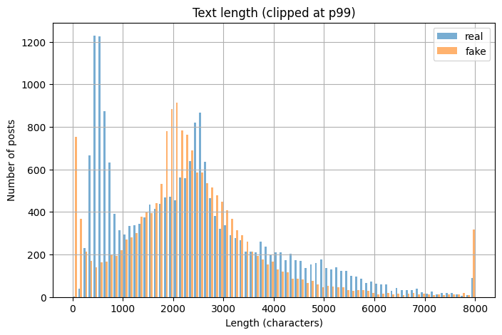
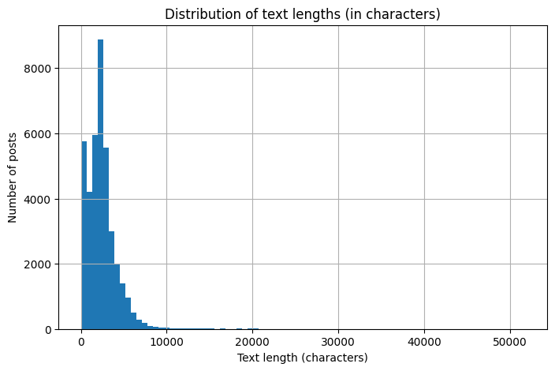

## 🔹 Project Summary
This project explores **Fake News Classification** using both classical ML methods and modern transformers. 
It includes **EDA, data cleaning, feature engineering, and model evaluation** with metrics (F1, Accuracy, Precision, Recall). 
Models compared: **Logistic Regression (BOW/TF-IDF), TF-IDF+SVD+XGBoost, and BERT fine-tuning**.  
**BERT** achieved the highest F1 (~0.999), while **BOW+LogReg** provided a strong, lightweight alternative (~0.996).


# Fake News Classification

## ✅ 1. Project Title
**Fake News Classification** – classification of news (fake vs real) with a comparison of classical approaches and transformer (**BERT**).

## ✅ 2. Project Description
- **What is it?** Full DS cycle: EDA -> cleaning -> split creation -> models -> conclusions.  
- **Problem:** automatic detection of fake news based on text.  
- **For whom:** developers/analysts (pipeline reproduction), recruiters/clients (overview of quality and solutions).  
- **Expected outcome:** selection of the best model for fake news detection based on comparative metrics.

## ✅ 3. Project Structure
```
fake-news-project/
├── README.md
├── .gitignore
├── notebooks/
│   ├── Fake_news_BERT.ipynb
│   ├── Fake_news_EDA.ipynb
│   ├── Fake_news_preprocessing_baseline_XGB.ipynb
│   └── Fake_news_results_summary.ipynb
├── results/
│   ├── final_project_model_results_summary.csv
│   └── figures/
│       ├── text_length_by_label_hist.png
│       ├── text_length_overall_hist.png
│       ├── wordcloud_overall.png
│       └── wordcloud_real_vs_fake.png
```

> **Leakage control:** cleaning (removing duplicates by `text_all`) and dropping `date` are performed **directly in modeling notebooks before split creation**; splits are formed with no overlaps and fixed `seed`.

## ✅ 4. How to Run

### Google Colab (recommended)

1) Open the desired notebook from the `notebooks/` folder in Colab.  

2) **Upload the raw dataset** `fake_news_full_data.csv` into the current environment directory, usually `/content/`
(the file is NOT stored in the repository, link below in sec.5):  
   - Via **Files → Upload**, or:
     ```python
     from google.colab import files
     files.upload()  # choose fake_news_full_data.csv
     ```
   - **(Option)** If stored in Google Drive:
     ```python
     from google.colab import drive
     drive.mount('/content/drive')
     # replace path below with yours
     import pandas as pd
     raw_df = pd.read_csv("/content/drive/MyDrive/path/to/fake_news_full_data.csv", index_col=0)
     ```

3) In modeling notebooks data is read as follows:
   ```python
   import random, numpy as np, pandas as pd, torch

   def fix_seed(seed: int = 42):
       random.seed(seed); np.random.seed(seed); torch.manual_seed(seed)

   fix_seed(42)

   raw_df = pd.read_csv("fake_news_full_data.csv", index_col=0)
   raw_df.head()
   ```

4) Run notebooks **in order**:
   1. `notebooks/Fake_news_EDA.ipynb`
   2. `notebooks/Fake_news_preprocessing_baseline_XGB.ipynb` – `DATA` -> cleaning -> splits -> classical models  
   3. `notebooks/Fake_news_BERT.ipynb` – `DATA` -> cleaning -> splits -> fine-tuning Bert  
   4. `notebooks/Fake_news_results_summary.ipynb` – metrics summary & plots  
      (reads local `final_project_model_results_summary.csv` if uploaded next to notebook, otherwise – `results/final_project_model_results_summary.csv` from repo).
    ```python
    from pathlib import Path
    import pandas as pd

    LOCAL = Path("final_project_model_results_summary.csv")
    REPO  = Path("results/final_project_model_results_summary.csv")

    path = LOCAL if LOCAL.exists() else REPO
    print(f"Reading from: {path}")
    df = pd.read_csv(path)
    df.head()
    ```

> Note: in every modeling notebook cleaning (removing duplicates by `text_all`, dropping `date`) is performed **before** split creation.

## ✅ 5. Data

**Source:** https://drive.google.com/file/d/1rribbwYNjHQ7EDiq3cA5CzEnqXCqD8-e/view?usp=sharing  
**File:** `fake_news_full_data.csv` (uploaded locally; not stored in Git)

**Main characteristics**
- Size: **44,680** rows × **5** columns  
- Columns and types:
  - `Unnamed: 0` – `int64` (index/auxiliary field; can be dropped)  
  - `title` – `object` (headline)  
  - `text` – `object` (full news text)  
  - `date` – `object` (string publication date)  
  - `is_fake` – `int64` (class label: `0` – real, `1` – fake)  
- Missing values: **none** in all columns  
- Class balance (`is_fake`): **1 -> 23,469**, **0 -> 21,211**

**Preprocessing (in notebooks, before splits)**  
1. Remove **duplicates** by text (`text`).  
2. Drop `date` **(to avoid leakage)**.  
3. Create `train/val/test` splits with fixed `seed`.  
4. Drop `Unnamed: 0` as unnecessary index.

> Data is uploaded locally (recommended folder `data/`), while cleaning and splits are done inside modeling notebooks.

## ✅ 6. EDA (Exploratory Data Analysis)
- Check class balance, text length distributions, n-grams, lexical diversity, noisy samples.  
- Details & plots: `notebooks/Fake_news_EDA.ipynb`.  

- ### Visualizations (EDA)
  
<sub>Comparison of most frequent words in real vs fake.</sub>

  
<sub>General wordcloud across the whole corpus.</sub>

  
<sub>Distribution of text lengths for real vs fake classes (trimmed at p99).</sub>

  
<sub>Overall distribution of text lengths in characters.</sub>

## ✅ 7. Modeling
**Tested approaches:**  
- **TF-IDF + Logistic Regression**  
- **BOW + Logistic Regression**  
- **TF-IDF + SVD + XGBoost**  
- **BERT** (fine-tuning)  

**Metrics:** F1, Accuracy, Precision, Recall.  
**Choice depends on trade-off:** quality <-> resources.  

**Summary materials**  
- Metrics table: `results/final_project_model_results_summary.csv`, `notebooks/Fake_news_results_summary.ipynb`

## ✅ 8. Results
**Main findings**  
- **BERT** – best F1 (~0.999).  
- **BOW + Logistic Regression** – almost as good (~0.996) and much cheaper to run (suitable for limited resources/low latency).  
- **TF-IDF + LogReg** – strong, interpretable baseline (~0.986).  
- **TF-IDF + SVD + XGBoost** – lower metrics (~0.983) in current setup; potential with tuning SVD/hyperparameters.  

**How to use it**  
- For **production with focus on quality** → **BERT**.  
- For **fast/large-scale scenarios** or when simple infrastructure matters → **BOW + LogReg**.  

**Limitations & risks**  
- Raw data in repo; cleaning (duplicates removal, dropping `date`) is done **in notebooks before splits**. Important to use same `seed` and cleaning logic across all notebooks.  
- Very high metrics (~1.0) should be **validated**: via cross-validation or external test (different time period/source).  
- News from other sources/styles may degrade performance; monitoring & periodic retraining required.

## ✅ 9. How to Use the Model
Models are not published as artifacts (.joblib/.pt); training & inference are run inside notebooks.  

- **Classical models:** open `notebooks/Fake_news_preprocessing_baseline_XGB.ipynb`, run cells from start (raw CSV -> cleaning -> splits -> training). At the end you’ll find **Inference/Prediction** section for new examples.  
- **BERT:** open `notebooks/Fake_news_BERT.ipynb`, run cells (raw CSV -> cleaning -> splits -> fine-tuning). In **Inference** section you’ll see how to predict for custom text.

## ✅ 10. To-Do / Ideas for Improvement
- **TF-IDF + SVD + XGBoost:** tune SVD size (100/200/300/500) and hyperparameters (`max_depth`, `n_estimators`, `learning_rate`).  
- **Stability:** run 5-fold CV and external test; report `mean ± std` for F1/Accuracy.  
- **Decision threshold:** adjust to business metric (not always 0.5).  

## ✅ 11. Author & Contacts
**Author:** Svitlana Lisovych  
**Email:** s.lisovych@gmail.com
